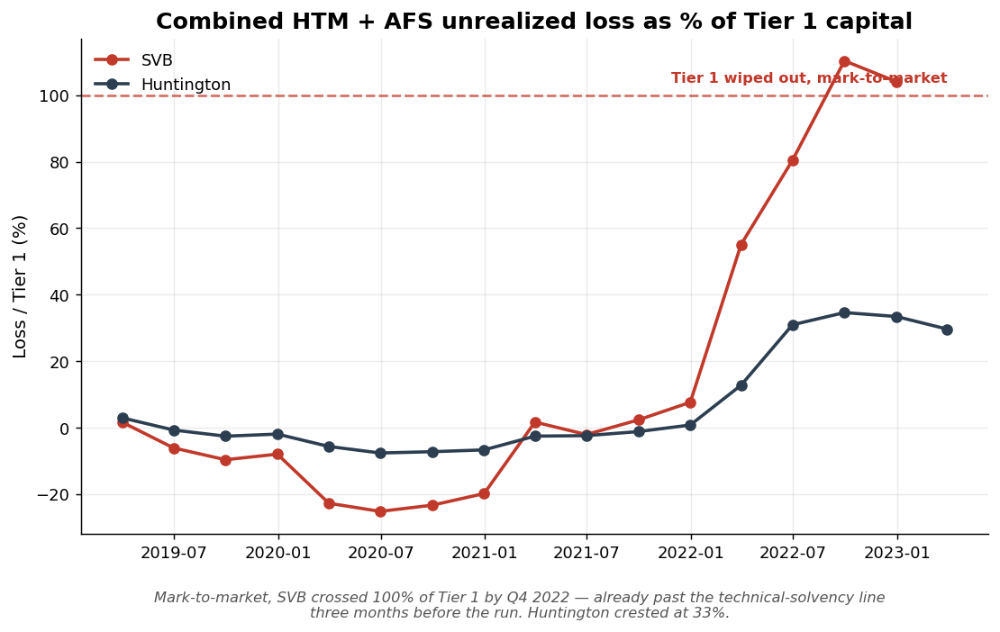
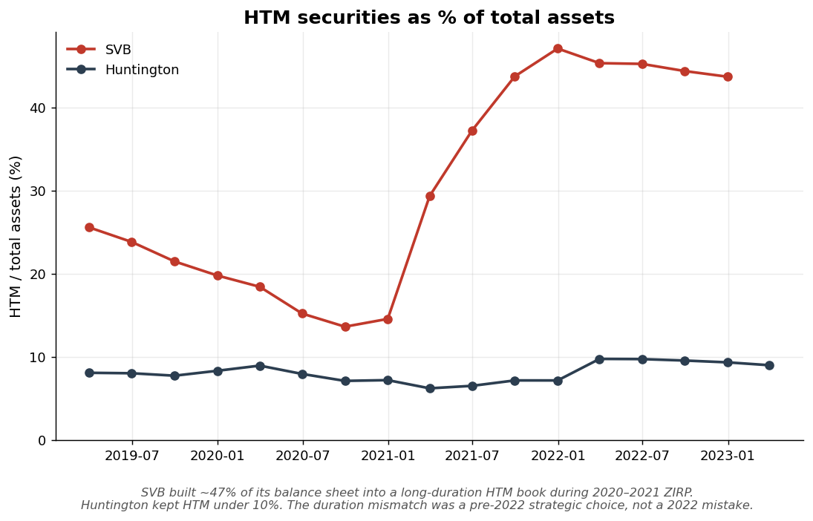
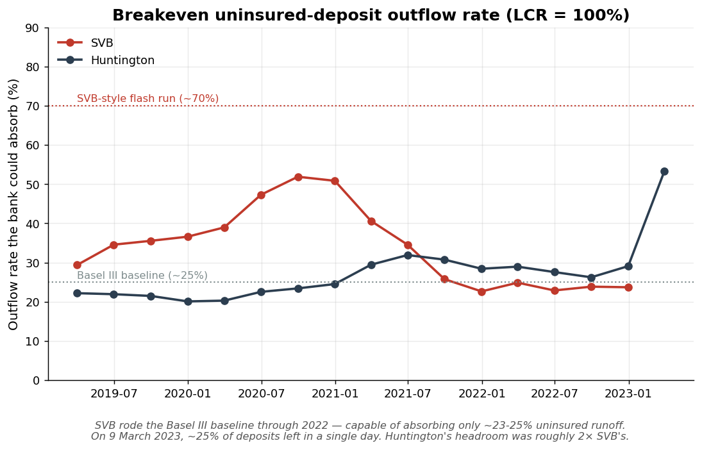

# ALM Rate Shock 2023

> **A senior-practitioner reconstruction of the 2022–2023 US rate shock through the SVB collapse**, contrasting Silicon Valley Bank against The Huntington National Bank as a same-size-class survivor. Built by [Jared Limon](#about) as a portfolio piece for senior risk leadership / quant strategy roles.

[](LICENSE)


---

## Headline finding

Mark-to-market, **SVB's combined HTM + AFS unrealized loss exceeded its entire Tier 1 capital base by Q4 2022 — three months before the FDIC seized the bank**. A simplified LCR model says SVB's liquidity headroom across all of 2022 was just **23–25% uninsured-deposit runoff**, the Basel III baseline. On 9 March 2023, ~25% of deposits left in a single day.

**The Call Report data knew, a full quarter before the FDIC did.** This project shows that any competent ALM framework, running on quarterly public regulatory filings, would have flagged SVB long before March 2023.



---

## The SVB story in four paragraphs

**The strategic choice (2020–2021).** Between Q1 2020 and Q1 2022, SVB's balance sheet nearly **quadrupled** from $59B to $217B. The deposit base was institutional and concentrated — venture-backed tech operating accounts, ~94% uninsured. With Fed funds at zero and 10-year Treasuries at 1.5%, SVB chose to invest the windfall in long-duration agency mortgage-backed securities at 1–2% coupons, and parked most of that portfolio in held-to-maturity (HTM) — a designation that prevents marking the book to market in normal reporting but also (per US GAAP and Reg WW) prevents selling without triggering taint-rule re-categorization of the entire portfolio. By the end of 2021, **47% of SVB's balance sheet was in HTM securities** with a weighted-average book yield of 1.79%. Huntington's comparable figure was 8%.

**The rate shock (2022).** The Fed delivered the steepest tightening cycle since Volcker — 425 basis points in nine months. The 2-year Treasury went from 0.7% to 4.4%. By Q4 2022, SVB's HTM book was sitting on a **$15.16B pre-tax unrealized loss** (disclosed in the 10-K; our cash-flow reconstruction lands at $15.4B — within 1.4%). Combined with $2.5B of AFS losses, total embedded losses crossed **104% of Tier 1 capital**. Mark-to-market, the bank was already past the technical-solvency line.

**The trap.** SVB's NII modeling had assumed a low deposit beta consistent with retail-sticky franchises (~0.3). Their actual deposit base — uninsured, institutional, tech-concentrated — behaved like a beta of 0.7. Under that assumption, our model says the same balance sheet that looked **+6% asset-sensitive** at low beta was actually **−22% liability-sensitive** at high beta. The asset side could not generate enough yield uplift to keep pace with the deposit side competing in the new rate regime, while HTM held them captive: selling it to fund outflows would force re-categorization of the entire portfolio and crystallize the $15B.

**The collapse.** When tech funding dried up and uninsured depositors started moving cash to higher-yielding alternatives, SVB's only liquid HQLA was AFS + cash — roughly $36B against a $161B deposit base. Their "breakeven uninsured outflow rate" (the runoff that would drive LCR to 100%) was just 23–25% across 2022. On 8 March 2023 they announced an AFS sale, crystallizing $1.8B of losses; on 9 March, ~25% of deposits left in a single day; on 10 March, the FDIC seized the bank. **RSSD 802866 has no Q1 2023 Call Report — the data itself bears the imprint of the failure.**

---

## Methodology in one paragraph each

- **Data.** All numbers are pulled fresh from public sources: the FFIEC Call Report bulk data ([Public Data Distribution](https://cdr.ffiec.gov/public/PWS/DownloadBulkData.aspx)) and FRED ([Treasury yields and policy rates](https://fred.stlouisfed.org)). Full 2019Q1–2023Q1 series for both banks. A Playwright-based automated downloader is included so anyone can reproduce the dataset in 4 minutes.

- **Repricing gap.** Six canonical IRRBB time bands (≤3M, 3-12M, 1-3Y, 3-5Y, 5-15Y, >15Y) aligned to FFIEC Schedule RC-B Memo 2 / RC-C Memo 2 / RC-E Memo 3. Non-maturity deposits are deliberately *excluded* from the gap and modeled separately via a deposit beta on the NII side. References: Federal Reserve SR 96-13; BIS IRRBB Standards (April 2016).

- **NII sensitivity.** Time-weighted 12-month NII delta under parallel rate shocks of ±100/200/300/400 bps. The deposit beta on non-maturity deposits is the most consequential parameter — the dashboard exposes it as a slider precisely to show how the *same balance sheet* flips from asset-sensitive to liability-sensitive at moderate beta values.

- **EVE / HTM unrealized-loss reconstruction.** Each maturity bucket in Schedule RC-B Memo 2 is modeled as a single representative bullet bond (face = amortized cost, coupon = portfolio book yield, maturity = bucket midpoint) and priced under the current Treasury curve. The MBS pass-through buckets use WAL-based midpoints rather than contractual maturity (Memo 2.b reports the wrong thing for a duration model); WAL defaults are calibrated to the Q4 2022 slow-prepay environment. **The model reconstructs SVB's published $15.16B HTM unrealized loss to within 1.4% from cash flows + the Treasury curve alone — never reading the fair-value field.**

- **Simplified LCR.** Central modeling claim: HTM securities are not HQLA. Under both Basel III and US Reg WW, selling HTM forces re-categorization of the entire HTM book to AFS, immediately recognizing every unrealized loss through AOCI — exactly what SVB had to do on 8 March 2023. So the model strips HTM from HQLA and computes: cash + (1 − haircut) × AFS_fair_value, divided by stressed 30-day deposit outflows. The dashboard's "breakeven uninsured outflow rate" — the runoff that drives LCR to 100% — is the single most direct view of each bank's liquidity headroom.

---

## Key results

### Reconciliation to published 10-K figures (Q4 2022)

| Metric | SVB modeled | SVB reported | Error |
|---|---:|---:|---:|
| Total assets | $209.0B | $209.0B | 0% |
| HTM amortized cost | $91.3B | $91.3B | 0% |
| **HTM + AFS unrealized loss (combined)** | **$17.94B** | **$17.69B** | **+1.4%** |
| Tier 1 capital | $17.0B | $17.0B | 0% |
| Uninsured deposit % | 93.9% | ~94% | <1pp |

### The SVB-vs-Huntington contrast at Q4 2022

| | SVB (casualty) | Huntington (survivor) |
|---|---:|---:|
| Total assets | $209B | $182B |
| HTM as % of total assets | **44%** | 9% |
| Combined unrealized loss / Tier 1 | **104%** | 33% |
| Uninsured deposit % | **94%** | 56% |
| Simplified LCR (default outflows) | **95%** | 114% |
| Breakeven uninsured outflow rate | **24%** | 29% |
| Survived 2023 | No (FDIC, 10 Mar 2023) | Yes |

### Hero charts

**HTM concentration.** The duration mismatch was a 2020–2021 strategic choice, not a 2022 mistake.



**Breakeven uninsured outflow rate.** The single most direct view of each bank's liquidity headroom — SVB hugged the Basel III baseline through all of 2022.



---

## How to reproduce

### Requirements

- Python 3.11+
- [`uv`](https://docs.astral.sh/uv/) (recommended) or `pip`
- A free [FRED API key](https://fred.stlouisfed.org/docs/api/api_key.html)

### 1 — Clone & install

```bash
git clone <repo-url>
cd alm-rate-shock-2023
uv venv
uv pip install -e ".[dashboard,dev]"
```

### 2 — Configure secrets

```bash
cp .env.example .env
# edit .env and paste your FRED API key
```

### 3 — Open the dashboard

The repo ships with a committed sample dataset (full 2019Q1–2023Q1 series) so the dashboard works immediately:

```bash
uv run streamlit run app/streamlit_app.py
```

Open http://localhost:8501 and walk the milestones M1 → M5 from the top of the page.

### 4 — (Optional) Pull fresh data

```bash
uv pip install -e ".[fetch]"
uv run playwright install chromium

# Automated FFIEC bulk download (~4 minutes for 17 quarters)
uv run python -m scripts.fetch_ffiec --headless --from 2019Q1 --to 2023Q1

# Parse into long-format parquet
uv run python -m scripts.pull_ffiec \
  --quarter 2019Q1 --quarter 2019Q2 --quarter 2019Q3 --quarter 2019Q4 \
  --quarter 2020Q1 --quarter 2020Q2 --quarter 2020Q3 --quarter 2020Q4 \
  --quarter 2021Q1 --quarter 2021Q2 --quarter 2021Q3 --quarter 2021Q4 \
  --quarter 2022Q1 --quarter 2022Q2 --quarter 2022Q3 --quarter 2022Q4 \
  --quarter 2023Q1

# Pull macro series from FRED
uv run python -m scripts.pull_fred --start 2019-01-01 --end 2023-03-31
```

### 5 — Run tests

```bash
uv run pytest      # 70 tests, ~1 second
uv run ruff check  # linting
```

---

## Repo layout

```
alm-rate-shock-2023/
├── README.md                       ← you are here
├── PROJECT_PROMPT.md               ← the original brief
├── DEPLOY.md                       ← Streamlit Cloud deployment guide
├── LICENSE                         ← MIT
├── pyproject.toml
├── requirements.txt                ← for Streamlit Cloud
├── .env.example
├── data/
│   ├── raw/                        ← FFIEC bulk ZIPs (gitignored)
│   ├── processed/                  ← parquet outputs (gitignored)
│   └── sample/                     ← committed sample parquets for fresh clones
├── docs/
│   └── charts/                     ← hero PNGs for this README
├── src/alm/
│   ├── config.py                   ← paths + tunable ALM assumptions
│   ├── data/
│   │   ├── banks.py                ← RSSD registry (SVB + Huntington)
│   │   ├── ffiec.py                ← Call Report bulk loader
│   │   ├── ffiec_schedules.py      ← MDRM code map
│   │   └── fred.py                 ← FRED API client
│   └── models/
│       ├── repricing_gap.py        ← M2: bucket classifier
│       ├── nii_sensitivity.py      ← M2: parallel-shock NII
│       ├── eve.py                  ← M3: bond pricing + EVE shock grid
│       └── liquidity.py            ← M5: simplified LCR
├── scripts/
│   ├── pull_ffiec.py               ← parse one or more quarters into parquet
│   ├── pull_fred.py                ← pull macro series
│   ├── fetch_ffiec.py              ← Playwright-based automated downloader
│   └── generate_hero_charts.py     ← regenerate the README's PNGs
├── tests/                          ← pytest, 70 tests
├── notebooks/                      ← exploratory only; no production logic
└── app/
    └── streamlit_app.py            ← the dashboard
```

---

## Limitations

A senior risk professional names their model's weaknesses; a junior one hides them. The known limitations:

- **Single book yield per portfolio.** The Call Report does not disclose per-bucket weighted-average coupons. We use each bank's 10-K-disclosed portfolio yield (SVB 1.79%, Huntington 2.40%) as a single value across all securities buckets. Exposed as a dashboard slider.

- **No prepayment modeling.** MBS pass-throughs are modeled as bullet bonds at WAL-based midpoints. The defaults (13Y for >15Y stated maturity, 6Y for 5-15Y) are calibrated to the Q4 2022 slow-prepay environment (~5% CPR). For lower-rate / fast-prepay regimes, these midpoints should be shorter. A proper CPR-aware cash flow model is on the roadmap.

- **Static gap model for NII.** Standard regulator-friendly formulation (SR 96-13). Real bank NII simulations include continuous reinvestment of maturing cash flows; ours doesn't. The static view is *more conservative* than disclosed bank simulations and arguably more honest for a postmortem — but it does understate near-term asset sensitivity.

- **Treasury-curve-only discounting.** Agency MBS trade at spread to Treasuries (OAS). We use the Treasury curve only. The bias is small (<5%) and conservative for relative comparisons.

- **Securities-portfolio EVE only.** ΔEVE is computed for the securities portfolio. Loan and deposit EVE are not modeled. For the SVB story this is acceptable — loans and deposits were marked at par on the balance sheet, and the securities mark is what blew through Tier 1.

- **Non-maturity deposits handled by beta, not by behavioral model.** No deposit-decay curve, no rate-elasticity model beyond a constant beta. The dashboard exposes the beta as a slider so the reader can see how sensitive the entire NII picture is to this single parameter — which is, in the end, the whole story.

- **Bank-level only.** We use FFIEC Call Reports (chartered bank level), not FR Y-9C (holding company level). For SVB this matters very little — the chartered bank held virtually all the relevant assets. For comparators with significant non-bank subsidiaries it would matter more.

- **No supervisory views.** Real ALM at a bank includes interest-rate risk reviews under multiple non-parallel scenarios (BIS IRRBB's six-scenario set), behavioral models calibrated on the bank's own depositor data, and dynamic balance-sheet projections. This is a public-data reconstruction; those things require internal data we don't have.

---

## What I'd build next

- **CPR-aware MBS cash flows.** A proper prepayment model — even a simple PSA-curve scaler — would let the EVE model handle non-parallel curve scenarios honestly.
- **The full BIS IRRBB six-scenario set.** Add steepener, flattener, short-rate-up, short-rate-down, long-rate-up, long-rate-down alongside the parallel shocks.
- **Deposit-decay modeling.** Calibrate a non-maturity-deposit retention curve from each bank's own historical balance trajectory.
- **Survival analysis.** Estimate, given each bank's quarterly balance sheet, the probability of breaching key thresholds (LCR < 100%, EVE / T1 < −X%) within a 12-month horizon under a stochastic rate scenario set.
- **A third comparator.** Possibly First Horizon (also a regional, also had stress in 2023) or Truist (different size class, different deposit franchise).

---

## About

**Jared Limon** — senior risk management leader, 15+ years across credit risk, market making, and quantitative risk strategy.

- **Principal Risk Architect at Bosonic Digital** — institutional FX market making, A/B book methodology, cross-custodian netting.
- **Lead Credit Risk Analyst at Tosh** — ML-driven credit scoring, PD/LGD forecasting.
- **Senior Risk Management Analyst at IBFX / TradeStation** — $1.2T institutional FX flow, A/B book methodology, ALM principles applied to broker book operations.

Currently job-searching for **senior risk leadership and quantitative strategist roles** in banks, fintechs, prop trading, and treasury functions.

**Contact:** jared@kuroshioflow.io

---

## License

[MIT](LICENSE). Code is portfolio-grade — *not* for production risk decisions.

---

*Built with explicit assumptions, configurable parameters, and citations to primary sources (Federal Reserve SR letters, BIS IRRBB standards, FFIEC Call Report instructions). Every modeling decision is named in code via `# ASSUMPTION:` comments and exposed to the reader.*
